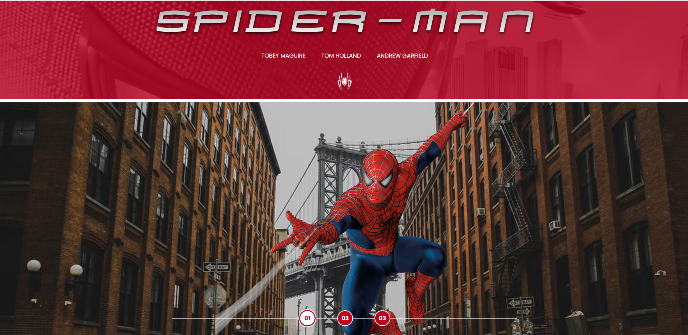

    

# Spiderman Multiverses | Curso Front-end da Rihappy na DIO 🚀

 Este repositório é parte do desafio do  **curso Rihappy Front-End** promovida pela [Digital Innovation One (DIO)](https://www.dio.me).
 

## 🔍 Sobre o Projeto

A proposta deste desafio foi desenvolver uma página web utilizando temas relacionadas a série temática que possibilita alternar entre entre os mundos **normal** e **invertido**, utilizando conceitos de
- Estruturação semântica com HTML;
- Estilização moderna e responsiva com CSS;
- Interatividade com JavaScript.
