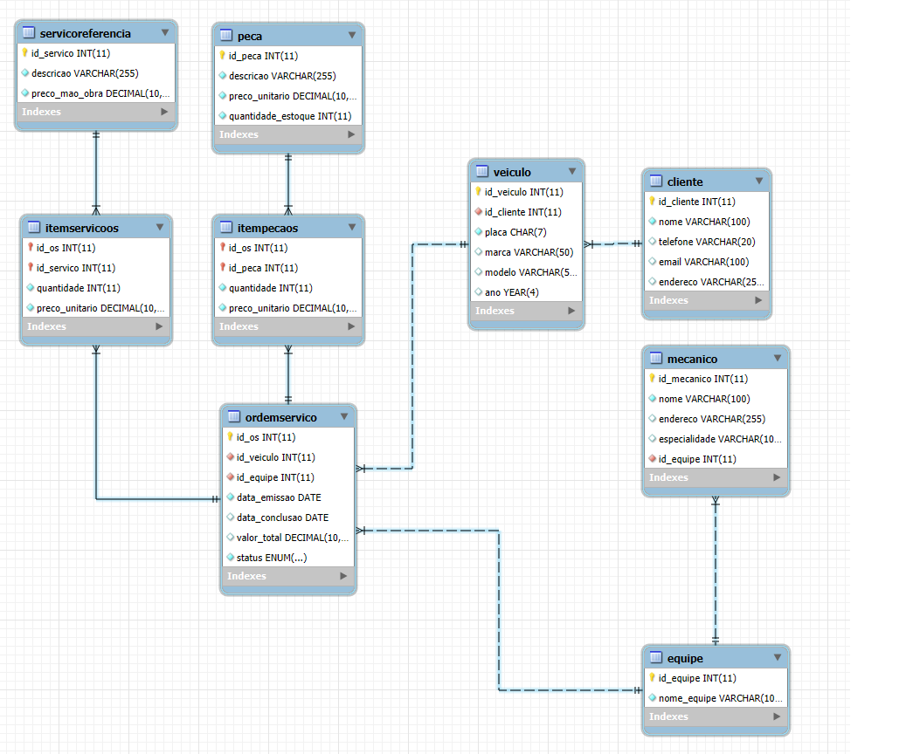

# Projeto Conceitual - Sistema de OS Para Oficina Mecânica

## 1. Proposta Inicial
- Sistema de controle e gerenciamento de execução de ordens de serviço em uma oficina mecânica.
- Clientes levam veículos à oficina mecânica para serem consertados ou para passarem por revisões periódicas.
- Cada veículo é designado a uma equipe de mecânicos que identifica os serviços a serem executados e preenche uma OS com data de entrega.
- A partir da OS, calcula-se o valor de cada serviço, consultando-se uma tabela de referência de mão-de-obra
- O valor de cada peça também irá compor a OS.
- O cliente autoriza a execução dos serviços.
- A mesma equipe avalia e executa os serviços.
- Os mecânicos possuem código, nome, endereço e especialidade.
- Cada OS possui: n°, data de emissão, um valor, status e uma data para conclusão dos trabalhos.

## 2. Melhorias Consideradas

- Controle não só da **Ordem de Serviço (OS)**, mas também do histórico de **serviços** e **peças usadas**.
- Veículos pertencem a clientes, e um cliente pode ter **mais de um veículo**.
- Uma OS pode ter **vários serviços** e **várias peças associadas**.
- Serviços referenciados a partir de uma tabela de **Serviços de Referência** (com preços padrão de mão de obra).
- Peças cadastradas separadamente, com **preço unitário** e **estoque**.
- Mecânicos agrupados em **equipes**.
- Uma equipe pode trabalhar em várias OS, mas cada OS é atribuída a **uma única equipe**.

---

## 3. Entidades e Atributos

### Cliente
- **id_cliente** (PK)
- nome
- telefone
- email
- endereco

### Veiculo
- **id_veiculo** (PK)
- id_cliente (FK)
- placa
- marca
- modelo
- ano

### Equipe
- **id_equipe** (PK)
- nome_equipe

### Mecanico
- **id_mecanico** (PK)
- nome
- endereco
- especialidade
- id_equipe (FK)

### ServicoReferencia
- **id_servico** (PK)
- descricao
- preco_mao_obra

### Peca
- **id_peca** (PK)
- descricao
- preco_unitario
- quantidade_estoque

### OrdemServico
- **id_os** (PK)
- id_veiculo (FK)
- id_equipe (FK)
- data_emissao
- data_conclusao
- valor_total
- status *(Aberta, Em execução, Con*

## 4. DER (WorkBench)

  

